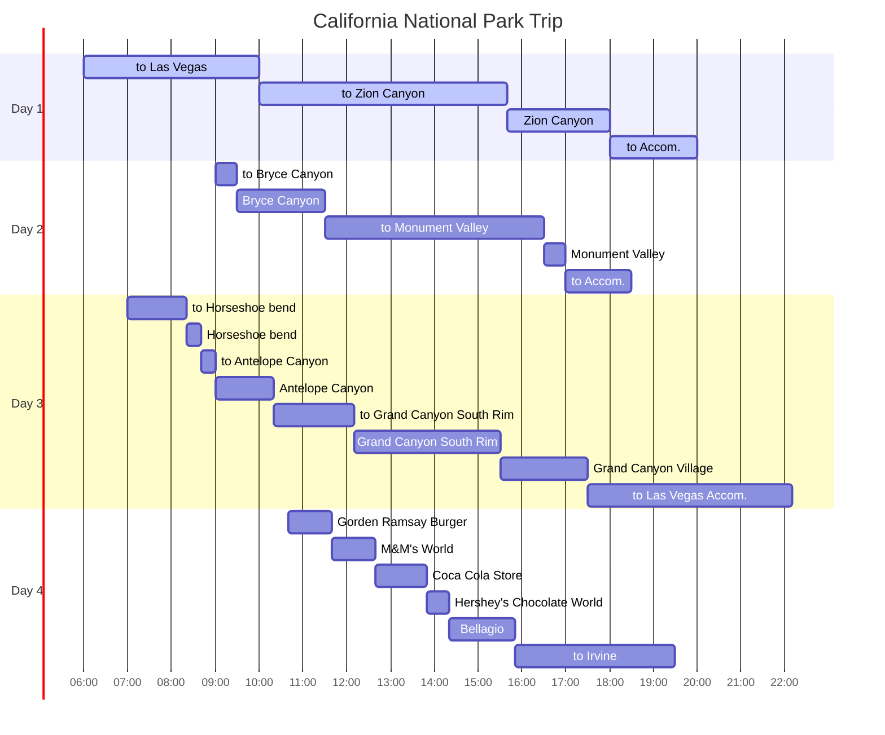
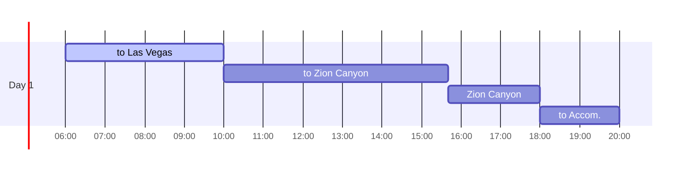
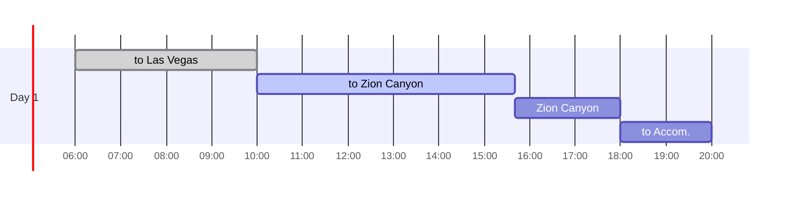
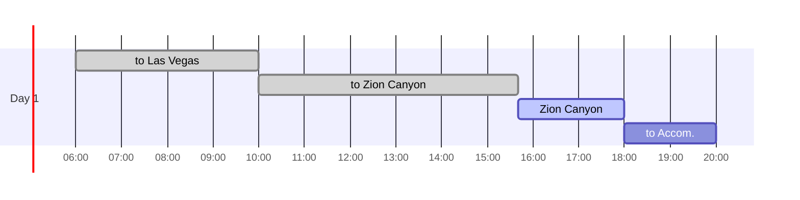
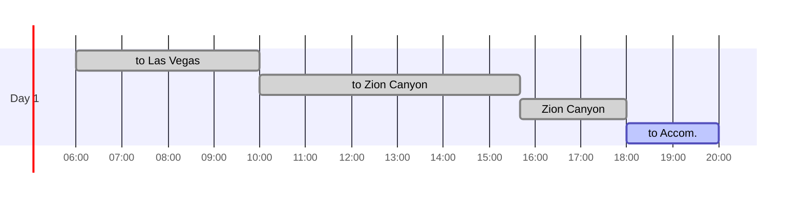

## Itineraries

```mermaid
gantt
dateFormat HH:mm
axisFormat %H:%M
title  California National Park Trip
section Day 1 
to Las Vegas: active, d1-1, 06:00, 10:00
to Zion Canyon: active, d1-2, after d1-1, 15:40
Zion Canyon: active, d1-3, after d1-2, 18:00
to Accom.: active, d1-4, after d1-3, 20:00
section Day 2
to Bryce Canyon : d2-1, 09:00, 30m
Bryce Canyon : d2-2, after d2-1, 2h
to Monument Valley: d2-3, after d2-2, 16:30
Monument Valley: d2-4, after d2-3, 17:00
to Accom.: d2-5, after d2-4, 18:30
section Day 3
to Horseshoe bend: d3-1, 07:00, 08:20
Horseshoe bend: d3-2, after d3-1, 08:40
to Antelope Canyon: d3-3, after d3-2, 09:00
Antelope Canyon: d3-4, after d3-3, 10:20
to Grand Canyon South Rim: d3-5, after d3-4, 12:10
Grand Canyon South Rim: d3-6, after d3-5, 15:30
Grand Canyon Village: d3-7, after d3-6, 17:30
to Las Vegas Accom.: d3-8, after d3-7, 22:10
section Day 4
Gorden Ramsay Burger: d4-1, 10:40, 11:40
M&M's World: d4-2, after d4-1, 12:40
Coca Cola Store: d4-3, after d4-2, 13:50
Hershey's Chocolate World: d4-4, after d4-3, 14:20
Bellagio: d4-5, after d4-4, 15:50
to Irvine: d4-6, after d4-5, 19:30
```

## To Las Vegas

```mermaid
gantt
dateFormat HH:mm
axisFormat %H:%M
section Day 1 
to Las Vegas: active, d1-1, 06:00, 10:00
to Zion Canyon: d1-2, after d1-1, 15:40
Zion Canyon: d1-3, after d1-2, 18:00
to Accom.: d1-4, after d1-3, 20:00
```

## To Zion Canyon

```mermaid
gantt
dateFormat HH:mm
axisFormat %H:%M
section Day 1 
to Las Vegas: done, d1-1, 06:00, 10:00
to Zion Canyon: active, d1-2, after d1-1, 15:40
Zion Canyon: d1-3, after d1-2, 18:00
to Accom.: d1-4, after d1-3, 20:00
```

## Zion Canyon

```mermaid
gantt
dateFormat HH:mm
axisFormat %H:%M
section Day 1 
to Las Vegas: done, d1-1, 06:00, 10:00
to Zion Canyon: done, d1-2, after d1-1, 15:40
Zion Canyon: active, d1-3, after d1-2, 18:00
to Accom.: d1-4, after d1-3, 20:00
```

## To Accommodation

```mermaid
gantt
dateFormat HH:mm
axisFormat %H:%M
section Day 1 
to Las Vegas: done, d1-1, 06:00, 10:00
to Zion Canyon: done, d1-2, after d1-1, 15:40
Zion Canyon: done, d1-3, after d1-2, 18:00
to Accom.: active, d1-4, after d1-3, 20:00
```