## Itineraries

## What to Pack for Travel

- [x] clothes
- [x] water
- [x] sunscreen
- [x] 세면도구 (칫솔, 치약, 폼클렌징, 바디워시 필수)
- [x] cup ramen
- [x] sunglasses
- [x] portable battery
- [x] 핫팩
- [x] 바베큐용 고기
- [x] 아이스박스 (고기 보관용)
- [x] 바베큐용 알루미늄 불판

## To Las Vegas

```mermaid
gantt
dateFormat HH:mm
axisFormat %H:%M
section Day 1
to Las Vegas: active, d1-1, 06:00, 10:00
to Zion Canyon: d1-2, after d1-1, 15:40
Zion Canyon: d1-3, after d1-2, 18:00
to Accom.: d1-4, after d1-3, 20:00
```

{: .shadow .rounded-10 h="500" }
_going to Las Vegas_

`Zion Canyon`을 가기 위해 `Las Vegas`를 경유했다. `Panera Bread`에서 포장해서 차 안에서 아침 겸 점심을 해결했다.

## To Zion Canyon

{: .shadow .rounded-10 h="500" }
_to Zion Canyon_

`Las Vegas`에서 `Zion Canyon`까지 약 5시간이 걸렸다.

## Zion Canyon

```mermaid
gantt
dateFormat HH:mm
axisFormat %H:%M
section Day 1
to Las Vegas: done, d1-1, 06:00, 10:00
to Zion Canyon: done, d1-2, after d1-1, 15:40
Zion Canyon: active, d1-3, after d1-2, 18:00
to Accom.: d1-4, after d1-3, 20:00
```

{: .shadow .rounded-10 h="500" }
_Zion Canyon Temple of SinaWaba_

{: .shadow .rounded-10 h="500" }
_Zion Canyon Somewhere_

{: .shadow .rounded-10 h="500" }
_Zion Canyon Souvenir shop_

산으로 둘러쌓인 절경을 감상할 수 있는 첫 번째 `National Park`이다.

게이트 통과 시 [National Park Interagency Pass][nationalparkpass]를 구입해서 입장했다.

[링크][zioncanyontrail]를 통해 trail 정보를 확인할 수 있다. 1번 지점에 주차하고 무료 셔틀버스를 통해 각 정류장을 이동할 수 있다.

5번 `Zion Lodge`에서는 숙박이 가능하다.

`E-bike`를 타거나 등산을 즐기는 사람들이 많았다.

`museum`은 17:00까지 운영하기 때문에 방문하지 못했다.

## To Accommodation

```mermaid
gantt
dateFormat HH:mm
axisFormat %H:%M
section Day 1
to Las Vegas: done, d1-1, 06:00, 10:00
to Zion Canyon: done, d1-2, after d1-1, 15:40
Zion Canyon: done, d1-3, after d1-2, 18:00
to Accom.: active, d1-4, after d1-3, 20:00
```

{: .shadow .rounded-10 h="500" }
_Bryce Country Cabin_

다음 일정을 위해 `Bryce Canyon` 인근에 위치한 [Bryce Country Cabin][brycecountrycabin]의 `Villa`에 묵었다.

독채, 침실 4개(방문이 없는 싱글 침대 방 포함), 화장실 2개, 바베큐 그릴과 차콜이 제공되는 숙소였다.

알루미늄 불판과 고기를 준비해 가서 저녁을 먹었고, 달이 밝은 날이었음에도 별이 잘 보였다.

[zioncanyontrail]: https://www.nps.gov/zion/planyourvisit/zion-canyon-trail-descriptions.htm
[nationalparkpass]: https://www.nps.gov/planyourvisit/pickup-pass-locations.htm
[brycecountrycabin]: https://www.expedia.com/Tropic-Hotels-Bryce-Country-Cabins.h5385158.Hotel-Information?locale=en_US&siteid=1&semcid=US.UB.GOOGLE.PT-c-EN.HOTEL&semdtl=a115095937557.b1128911123373.g1kwd-538677591.e1c.m1Cj0KCQjwzZmwBhD8ARIsAH4v1gUG9J_ZgHg633k273s7Chtdp3QBH2FXJIluAUtVvYfEF_VPrQGNwZYaAvezEALw_wcB.r187068b9132053d809132ec7d32a4cf9853ef2a6b32999b3fbdad73ed62a2fe7d.c1.j19031523.k1.d1651457185545.h1p.i1.l1.n1.o1.p1.q1.s1.t1.x1.f1.u1.v1.w1&gad_source=1&gclid=Cj0KCQjwzZmwBhD8ARIsAH4v1gUG9J_ZgHg633k273s7Chtdp3QBH2FXJIluAUtVvYfEF_VPrQGNwZYaAvezEALw_wcB
