## Itineraries

```mermaid
gantt
dateFormat HH:mm
axisFormat %H:%M
title  California National Park Trip
section Day 1
to Las Vegas: done, d1-1, 06:00, 10:00
to Zion Canyon: done, d1-2, after d1-1, 15:40
Zion Canyon: done, d1-3, after d1-2, 18:00
to Accom.: done, d1-4, after d1-3, 20:00
section Day 2
to Bryce Canyon : active, d2-1, 09:00, 30m
Bryce Canyon : active, d2-2, after d2-1, 2h
to Monument Valley: active, d2-3, after d2-2, 16:30
Monument Valley: active, d2-4, after d2-3, 17:00
to Accom.:  active, d2-5, after d2-4, 18:30
section Day 3
to Horseshoe bend: d3-1, 07:00, 08:20
Horseshoe bend: d3-2, after d3-1, 08:40
to Antelope Canyon: d3-3, after d3-2, 09:00
Antelope Canyon: d3-4, after d3-3, 10:20
to Grand Canyon Desert View: d3-5, after d3-4, 12:10
Grand Canyon Desert View: d3-6, after d3-5, 15:30
Grand Canyon Visitor Center & Village: d3-7, after d3-6, 17:30
to Las Vegas Accom.: d3-8, after d3-7, 22:10
section Day 4
Gorden Ramsay Burger: d4-1, 10:40, 11:40
M&M's World: d4-2, after d4-1, 12:40
Coca Cola Store: d4-3, after d4-2, 13:50
Hershey's Chocolate World: d4-4, after d4-3, 14:20
Bellagio: d4-5, after d4-4, 15:50
to Irvine: d4-6, after d4-5, 19:30
```

{: .shadow .rounded-10 h="500" }
_Travel Routes_

## To Bryce Canyon

숙소에서 `Bryce Canyon`으로 이동했다.

## Bryce Canyon

{: .shadow .rounded-10 h="500" }
_Bryce Canyon 1_

{: .shadow .rounded-10 h="500" }
_Bryce Canyon 2_

{: .shadow .rounded-10 h="500" }
_Bryce Canyon 3_

3월에도 눈 덮인 절경을 감상할 수 있다.

특정 포인트를 방문하여 주차장에 주차하고, 조금만 걸어가면 경치를 감상할 수 있다.

빙판길에서는 넘어질 수 있으니 조심해야 한다.

가능하면 crampons를 착용하는 것이 좋다.

## To Monument Valley

{: .shadow .rounded-10 h="500" }
_Bryce Canyon 1_

{: .shadow .rounded-10 h="500" }
_Bryce Canyon 2_

이번 여행지 중에서 집과 가장 먼 거리에 위치한 `Monument Valley`를 향해 약 5시간 동안 이동했다.

중간에 `KFC`에서 점심을 해결했다.

## Monument Valley

{: .shadow .rounded-10 h="500" }
_Monument Valley 1_

{: .shadow .rounded-10 h="500" }
_Monument Valley 2_

{: .shadow .rounded-10 h="500" }
_Monument Valley 3_

[Monument Vally Trading Post][monumentvalleytradingpost]에 도착했다.

`National Park Interagency Annual Pass`가 있었음에도 별도 입장료를 지불해야 한다.

드넓은 평지에 우뚝 솟은 붉은 바위 경치를 볼 수 있고, 작은 museum과 souvenir shop이 있다.

`Monument Vally Trading Post at The View Hotel`은 예약이 차있어서 예약하지 못했다.

`Monument Vally Trading Post`는 별도의 입장료가 있고, 차량을 타고 바위가 둘러쌓인 구역의 view point에 갈 수가 있는데, 입장 시간이 제한되어 있어서 들어가지는 않았다.

## To Accommodation

{: .shadow .rounded-10 h="500" }
_Bluff Dwellings 1_

{: .shadow .rounded-10 h="500" }
_Bluff Dwellings 2_

{: .shadow .rounded-10 h="500" }
_Bluff Dwellings 3_

`Monument Valley`로부터 약 1시간 30분 이동해서 숙소인 [Bluff Dwellings Resort][bluffdwellingsresort]에 도착했다.

가스 방식 Barbecue grill이 제공된다.

주변에 market이 없기 때문에 경로 중간에 음식을 사오거나, 내부에 위치한 [Cedar Shack Café][cedarsnackcafe]에서 pizza, smothie, salad 등 다양한 메뉴를 합리적인 가격에 먹을 수 있다.

pizz와 smothie를 포장해서 숙소에 먹었는데, 맛이 괜찮았다.

spa에서 massage, nail 등 다양한 care service를 제공하지만, 가격은 비싼 편이다.

[monumentvalleytradingpost]: https://maps.app.goo.gl/mDyywUtK8hv25DHi9
[bluffdwellingsresort]: https://bluffdwellings.com
[cedarsnackcafe]: https://bluffdwellings.com/cedar-shack-cafe-bluff-utah-restaurant/