## Itineraries

```mermaid
gantt
dateFormat HH:mm
axisFormat %H:%M
title  California National Park Trip
section Day 1
to Las Vegas: done, d1-1, 06:00, 10:00
to Zion Canyon: done, d1-2, after d1-1, 15:40
Zion Canyon: done, d1-3, after d1-2, 18:00
to Accom.: done, d1-4, after d1-3, 20:00
section Day 2
to Bryce Canyon : done, d2-1, 09:00, 30m
Bryce Canyon : done, d2-2, after d2-1, 2h
to Monument Valley: done, d2-3, after d2-2, 16:30
Monument Valley: done, d2-4, after d2-3, 17:00
to Accom.:  done, d2-5, after d2-4, 18:30
section Day 3
to Horseshoe bend: active, d3-1, 07:00, 08:20
Horseshoe bend: active, d3-2, after d3-1, 08:40
to Antelope Canyon: active, d3-3, after d3-2, 09:00
Antelope Canyon: active, d3-4, after d3-3, 10:20
to Grand Canyon Desert View: active, d3-5, after d3-4, 12:10
Grand Canyon Desert View: active, d3-6, after d3-5, 15:30
Grand Canyon Visitor Center & Village: active, d3-7, after d3-6, 17:30
to Las Vegas Accom.: active, d3-8, after d3-7, 22:10
section Day 4
Gorden Ramsay Burger: d4-1, 10:40, 11:40
M&M's World: d4-2, after d4-1, 12:40
Coca Cola Store: d4-3, after d4-2, 13:50
Hershey's Chocolate World: d4-4, after d4-3, 14:20
Bellagio: d4-5, after d4-4, 15:50
to Irvine: d4-6, after d4-5, 19:30
```

{: .shadow .rounded-10 h="500" }
_Travel Routes_

## To Horsheo bend

```mermaid
gantt
dateFormat HH:mm
axisFormat %H:%M
section Day 3
to Horseshoe bend: active, d3-1, 07:00, 08:20
Horseshoe bend: d3-2, after d3-1, 08:40
to Antelope Canyon: d3-3, after d3-2, 09:00
Antelope Canyon: d3-4, after d3-3, 10:20
to Grand Canyon Desert View: d3-5, after d3-4, 12:10
Grand Canyon Desert View: d3-6, after d3-5, 15:30
Grand Canyon Visitor Center & Village: d3-7, after d3-6, 17:30
to Las Vegas Accom.: d3-8, after d3-7, 22:10
```

숙소인 [Bluff Dwellings Resort][bluffdwellingsresort]는 `Utah` 주에 해당하기 때문에 `California` 보다 시차가 1시간 더 빠르기 때문에 9:00에 예약했던 `Antelope Canyon`에 1시간 일찍 도착했다.

1시간 동안 `Antelope Canyon`에 대기하는 것보다 가까이 위치한 `Horshoe bend`를 다녀오기로 결정하고 경로를 변경했다.

## Horsheo bend

```mermaid
gantt
dateFormat HH:mm
axisFormat %H:%M
section Day 3
to Horseshoe bend: done, d3-1, 07:00, 08:20
Horseshoe bend: active, d3-2, after d3-1, 08:40
to Antelope Canyon: d3-3, after d3-2, 09:00
Antelope Canyon: d3-4, after d3-3, 10:20
to Grand Canyon Desert View: d3-5, after d3-4, 12:10
Grand Canyon Desert View: d3-6, after d3-5, 15:30
Grand Canyon Visitor Center & Village: d3-7, after d3-6, 17:30
to Las Vegas Accom.: d3-8, after d3-7, 22:10
```

{: .shadow .rounded-10 h="500" }
_Horshoe bend 1_

{: .shadow .rounded-10 h="500" }
_Horshoe bend 2_

말발굽처럼 생긴 협곡이라는 것 외 특별한 것은 없었다.

차량 당 $10의 입장료가 존재하며, 주차 지점에서 약 10분간 걸어가야 한다.

`fence` 외 안전장치가 없기 때문에 조심해야 한다.

## to Antelope Canyon

```mermaid
gantt
dateFormat HH:mm
axisFormat %H:%M
section Day 3
to Horseshoe bend: done, d3-1, 07:00, 08:20
Horseshoe bend: done, d3-2, after d3-1, 08:40
to Antelope Canyon: active, d3-3, after d3-2, 09:00
Antelope Canyon: d3-4, after d3-3, 10:20
to Grand Canyon Desert View: d3-5, after d3-4, 12:10
Grand Canyon Desert View: d3-6, after d3-5, 15:30
Grand Canyon Visitor Center & Village: d3-7, after d3-6, 17:30
to Las Vegas Accom.: d3-8, after d3-7, 22:10
```

`Horshoe bend`와 `Antelope Canyon` 간 거리는 20분 내로 가깝다.

## Antelope Canyon

```mermaid
gantt
dateFormat HH:mm
axisFormat %H:%M
section Day 3
to Horseshoe bend: done, d3-1, 07:00, 08:20
Horseshoe bend: done, d3-2, after d3-1, 08:40
to Antelope Canyon: done, d3-3, after d3-2, 09:00
Antelope Canyon: active, d3-4, after d3-3, 10:20
to Grand Canyon Desert View: d3-5, after d3-4, 12:10
Grand Canyon Desert View: d3-6, after d3-5, 15:30
Grand Canyon Visitor Center & Village: d3-7, after d3-6, 17:30
to Las Vegas Accom.: d3-8, after d3-7, 22:10
```

{: .shadow .rounded-10 h="500" }
_Antelope Canyon 1_

{: .shadow .rounded-10 h="500" }
_Antelope Canyon 2_

{: .shadow .rounded-10 h="500" }
_Antelope Canyon 3_

이번 여행지 중 사진을 가장 많이 찍은 곳이다.

특정 시간대에 tour를 반드시 예약해야 들어갈 수 있으며, 어른 $85, 0-7세 어린이는 $75이다.

macOS의 배경화면 촬영지로 유명하다.

guide가 iPhone, Android에 따라 사진을 잘 찍기 위해 필터 설정하는 법을 알려주었다.

{: .shadow .rounded-10 w="300" }
_iPhone Filter Setup 1_

1) camera app을 열고, 화면을 위로 쓸어올리거나 `^` 버튼을 누른다.

{: .shadow .rounded-10 w="300" }
_iPhone Filter Setup 2_

2) 아래 추가 메뉴들이 표시되면, 왼쪽으로 쓸어넘긴다.

{: .shadow .rounded-10 w="300" }
_iPhone Filter Setup 3_

3) 3개 원이 있는 icon을 누른다.

{: .shadow .rounded-10 w="300" }
_iPhone Filter Setup 4_

4) `VIVID WARM`을 누른다.

Android도 warm 필터를 설정해서 촬영하면 된다.

아래 부분은 어두워서 사진이 잘 나오지 않기 때문에, 대부분 하늘을 바라보며 촬영하게 된다.

하늘히 하얗게 표시되면 색감이 너무 밝게 표시 되기 때문에, 하늘을 focusing한 상태에서 하늘이 푸른색이 되도록 밝기를 낮춰서 촬영하면 사진이 잘 나온다.

guide를 잘 따라다니면 사진을 찍어주기도 한다.

tour는 약 1시간이며, 별도 tip으로 $10을 지불했다.

## to Grand Canyon

```mermaid
gantt
dateFormat HH:mm
axisFormat %H:%M
section Day 3
to Horseshoe bend: done, d3-1, 07:00, 08:20
Horseshoe bend: done, d3-2, after d3-1, 08:40
to Antelope Canyon: done, d3-3, after d3-2, 09:00
Antelope Canyon: done, d3-4, after d3-3, 10:20
to Grand Canyon Desert View: active, d3-5, after d3-4, 12:10
Grand Canyon Desert View: d3-6, after d3-5, 15:30
Grand Canyon Visitor Center & Village: d3-7, after d3-6, 17:30
to Las Vegas Accom.: d3-8, after d3-7, 22:10
```

`Grand Canyon`을 향해 약 4시간을 이동했다.

## Grand Canyon Desert View

```mermaid
gantt
dateFormat HH:mm
axisFormat %H:%M
section Day 3
to Horseshoe bend: done, d3-1, 07:00, 08:20
Horseshoe bend: done, d3-2, after d3-1, 08:40
to Antelope Canyon: done, d3-3, after d3-2, 09:00
Antelope Canyon: done, d3-4, after d3-3, 10:20
to Grand Canyon Desert View: done, d3-5, after d3-4, 12:10
Grand Canyon Desert View: active, d3-6, after d3-5, 15:30
Grand Canyon Visitor Center & Village: d3-7, after d3-6, 17:30
to Las Vegas Accom.: d3-8, after d3-7, 22:10
```

{: .shadow .rounded-10 h="500" }
_Desert View Market & Deli_

{: .shadow .rounded-10 h="500" }
_Desert View Watchtower outside_

{: .shadow .rounded-10 h="500" }
_Desert View Watchtower inside_

{: .shadow .rounded-10 h="500" }
_Grand Canyon Desert View at the upper floors of Watchtower_

도착 직후 `Desert View Market & Deli`에서 점심을 먹었다.

burger, sandwich, soup 등 다양한 메뉴가 있으며, 맛은 괜찮았다.

식당 옆 market에서는 다양한 기념품을 판매하는데, `Grand Canyon Village`의 `Park Store`에서 판매하는 항목과 다르기 때문에 마음에 드는 제품은 구매하는 것이 좋다.

`Desert View Watchtower`는 sunset 명소로 유명한 곳이다.

점심 시간이라 sunset을 보지는 못했지만 사람들이 많았다.

[Desert View Watchtower][desertviewwatchtower]에 올라가려면 줄을 서서 ticket을 받아야 한다.

8:20 am to 4:40 pm 사이에 20분 간격으로 25명만 올라갈 수 있도록 ticket을 나눠준다.

`Grand Canyon` 절경을 내려다 볼 수 있다.

## Grand Canyon Visitor Center & Village

```mermaid
gantt
dateFormat HH:mm
axisFormat %H:%M
section Day 3
to Horseshoe bend: done, d3-1, 07:00, 08:20
Horseshoe bend: done, d3-2, after d3-1, 08:40
to Antelope Canyon: done, d3-3, after d3-2, 09:00
Antelope Canyon: done, d3-4, after d3-3, 10:20
to Grand Canyon Desert View: done, d3-5, after d3-4, 12:10
Grand Canyon Desert View: done, d3-6, after d3-5, 15:30
Grand Canyon Visitor Center & Village: active, d3-7, after d3-6, 17:30
to Las Vegas Accom.: d3-8, after d3-7, 22:10
```

{: .shadow .rounded-10 h="500" }
_Grand Canyon 1_

{: .shadow .rounded-10 h="500" }
_Grand Canyon 2_

{: .shadow .rounded-10 h="500" }
_Grand Canyon 3_

### Grand Canyon Visitor Center

`Grand Canyon Visitor Center`로 이동 후 셔틀 버스로 이동할 수 있다.

경로는 [link][grandcanyonpocketmap]를 참고한다.

`Mather Point`와 `Yavapai Point`를 방문했으며, 다양한 각도에서 `Grand Canyon`을 감상할 수 있다.

`Yavapai Point`에는 규모가 작고 `Glory Museum`이 존재한다.

### Grand Canyon Village

`Park Store`에서 다양한 기념품을 구매할 수 있다.

## to Las Vegas Accommodation

```mermaid
gantt
dateFormat HH:mm
axisFormat %H:%M
section Day 3
to Horseshoe bend: done, d3-1, 07:00, 08:20
Horseshoe bend: done, d3-2, after d3-1, 08:40
to Antelope Canyon: done, d3-3, after d3-2, 09:00
Antelope Canyon: done, d3-4, after d3-3, 10:20
to Grand Canyon Desert View: done, d3-5, after d3-4, 12:10
Grand Canyon Desert View: done, d3-6, after d3-5, 15:30
Grand Canyon Visitor Center & Village: done, d3-7, after d3-6, 17:30
to Las Vegas Accom.: active, d3-8, after d3-7, 22:10
```

{: .shadow .rounded-10 h="500" }
_Shopping Center_

{: .shadow .rounded-10 h="500" }
_Sphere at the accomodation_

{: .shadow .rounded-10 h="500" }
_Accomodation View_

4시간 30분에 걸쳐 `Las Vegas`에 위치한 [Hilton Grand Vacations Club Elara Center Strip Las Vegas][hilton-grand-vacations-club-elara-center-strip-las-vegas]에 도착했다.

shopping center와 연결되어 있고, casino가 없기 때문에 아기가 있다면 좋은 환경을 제공한다(하지만, Las Vegas를 관광하면서 casino를 지나치지 않기는 힘들다).

숙소 인근 Korean BBQ에서 늦은 저녁을 먹었는데, 불친절한 직원, 비위생적, 느린 서비스로 인해 추천하지 않는다.

[bluffdwellingsresort]: https://bluffdwellings.com
[desertviewwatchtower]: https://www.nps.gov/places/000/desert-view-watchtower.htm
[grandcanyonpocketmap]: https://www.nps.gov/grca/learn/news/upload/sr-pocket-map.pdf
[hilton-grand-vacations-club-elara-center-strip-las-vegas]: https://www.reservationcounter.com/hotels/show/5f82a62/hilton-grand-vacations-club-elara-center-strip-las-vegas/?cid=sem::TPRC::AW::::::::&creative=&device=c&AdPos=&utm_source=google&utm_medium=cpc&utm_term=&utm_campaign=&iv_=__iv_p_1_a_15452348771_g__w__h_9031569_ii__d_c_v__n_x_c__k__m__l__t__e__r__vi__&gad_source=1&gclid=EAIaIQobChMI--CcmcWfhQMVfzbUAR1UbgJvEAAYASAAEgLisPD_BwE