## Itineraries

```mermaid
gantt
dateFormat HH:mm
axisFormat %H:%M
title  California National Park Trip
section Day 1
to Las Vegas: done, d1-1, 06:00, 10:00
to Zion Canyon: done, d1-2, after d1-1, 15:40
Zion Canyon: done, d1-3, after d1-2, 18:00
to Accom.: done, d1-4, after d1-3, 20:00
section Day 2
to Bryce Canyon : done, d2-1, 09:00, 30m
Bryce Canyon : done, d2-2, after d2-1, 2h
to Monument Valley: done, d2-3, after d2-2, 16:30
Monument Valley: done, d2-4, after d2-3, 17:00
to Accom.:  done, d2-5, after d2-4, 18:30
section Day 3
to Horseshoe bend: done, d3-1, 07:00, 08:20
Horseshoe bend: done, d3-2, after d3-1, 08:40
to Antelope Canyon: done, d3-3, after d3-2, 09:00
Antelope Canyon: done, d3-4, after d3-3, 10:20
to Grand Canyon Desert View: done, d3-5, after d3-4, 12:10
Grand Canyon Desert View: done, d3-6, after d3-5, 15:30
Grand Canyon Visitor Center & Village: done, d3-7, after d3-6, 17:30
to Las Vegas Accom.: done, d3-8, after d3-7, 22:10
section Day 4
Gorden Ramsay Burger: active, d4-1, 10:40, 11:40
M&M's World: active, d4-2, after d4-1, 12:40
Coca Cola Store: active, d4-3, after d4-2, 13:50
Hershey's Chocolate World: active, d4-4, after d4-3, 14:20
Bellagio: active, d4-5, after d4-4, 15:50
to Irvine: active, d4-6, after d4-5, 19:30
```

{: .shadow .rounded-10 h="500" }
_Travel Routes_

## Gorden Ramsay Burger

{: .shadow .rounded-10 h="500" }
_Gorden Ramsay Burger 1_

{: .shadow .rounded-10 h="500" }
_Gorden Ramsay Burger 2_

{: .shadow .rounded-10 h="500" }
_Gorden Ramsay Burger 3_

{: .shadow .rounded-10 h="500" }
_Gorden Ramsay Burger 4_ 

[Gorden Ramsay Burger][gordonramsayburger]에 점심을 먹으러 갔다.

숙소 주차장에 주차가 가능한 것을 확인하고, 도보로 이동했다.

우리가 먹은 메뉴는 아래와 같다.

- 24 Hour Burger: $33.99
- Truffle Burger: $33.99
- Fish & Cripst Sandwich: $33.99
- Blue Cheeseburger: $33.99
- English Toffee Shake $11.99
- Oreo Creme Brulee Shake: $11.99

burger가 4개이므로 4개의 Fry를 선택할 수 있었다. `Sweet Potato Fry`와 `Truffle Parmesan Fry`는 추가 금액이 든다.

- 1 Just Fry
- 2 Sweet Potato Fry
- 1 Truffle Parmesan Fry

대체적으로 맛이 있었다.

가장 맛있었던 메뉴를 꼽자면 `Fish & Cripst Sandwich`였다.

생선 살이 맛이 있었고, 독특한 sauce와 얇고 바삭한 감자 식감이 좋았다.

## M&M's World

{: .shadow .rounded-10 h="500" }
_M&M's World entrance_ 

{: .shadow .rounded-10 h="500" }
_M&M's World_

`M&M's`와 관련된 다양한 goods를 판매하는 곳이다.

4층 규모이며, 제품군들이 다양하고 깔끔하다.

## Coca Cola Store

{: .shadow .rounded-10 h="500" }
_Coca Cola Store entrance_ 

{: .shadow .rounded-10 h="500" }
_Coca Cola Store_ 

{: .shadow .rounded-10 h="500" }
_Coca Cola Store samplers_ 

`M&M's World` 바로 옆에 위치해 있다.

`Coca Cola`와 관련된 goods를 판매하는 곳이며, 2층에서 전세계 `Coca Cola`의 다양한 맛을 sampler로 먹어 볼 수 있다.

독특한 맛 때문에 3-4가지를 제외하고 재미로 즐기면 될 것 같다.

## Hershey's Chocolate World

{: .shadow .rounded-10 h="500" }
_Hershey's Chocolate World_

world라고 하기에는 1층으로만 구성되어 있으며, 규모가 작다.

## Bellagio

### Bellagio/Park MGM Tram

{: .shadow .rounded-10 h="500" }
_Bellagio/Park MGM Tram_

`Bellagio` hotel에서 [Fountain show][bellagio-fountain-show-schedule]를 관람하기 위해 `Hershey's Chocolate World` 인근에 위치한 `Park MGM`에서 `tram`을 타고 이동했다.

[Tram][las-vegas-monotail-tram-map]은 4-8분 간격으로 다니며, `Bellagio/Park MGM Tram` 구간은 무료이다.

### Bellagio Fountains Show

{: .shadow .rounded-10 h="500" }
_Bellagio Fountains Show_

`Bellagio` hotel의  [Fountains Show][bellagio-fountain-show-schedule]는 평일 15:00-18:30, 19:00-24:00에 15분 간격으로 운행한다.

한 번쯤 볼만 하다.

### Bellagio Conservatory & Botanical Gardens

{: .shadow .rounded-10 h="500" }
_Bellagio Conservatory & Botanical Gardens_

`Bellagio` hotel 내에 있는 `Conservatory & Botanical Garden`은 동화 속에 나올 법한 거대 조형물과 생화로 가득차 있는 곳이다.

### Bellagio Patisserie

{: .shadow .rounded-10 h="500" }
_Bellagio Patisserie_

`Bellagio Patisserie`는 간단한 아침 메뉴와 빵, 음료 등을 판매하는 작은 카페이다(우연히 앞에 계신 분의 선행으로 음료와 빵을 사주셨다).

## to Irvine

{: .shadow .rounded-10 h="500" }
_to Irvine_

모든 일정을 마치고, 돌아가는 길에 석양을 촬영했다.

저녁으로 [Chai Lan][chailan]에서 음식을 포장해서 먹었다.

장시간 이동과 tight한 일정으로 인해 3박 4일 간 피곤함도 많았던 여정이었지만, 간만에 여행다운 여행을 다녀온 것 같았다.

산으로 둘러쌓인 푸른 경치를 지닌 우리나라와 달리, `California`의 자연은 끝없이 펼쳐진 평지를 감상할 수 있었다.

[gordonramsayburger]: https://www.gordonramsayrestaurants.com/en/us/gordon-ramsay-burger/menus/las-vegas
[bellagio-fountain-show-schedule]: https://www.visitlasvegas.com/listing/fountains-of-bellagio/34849/
[las-vegas-monotail-tram-map]: https://www.vegasjourney.com/monorail_tram_map_las_vegas.htm
[chailan]: https://maps.app.goo.gl/FPEz4WUpns3fi3cC6