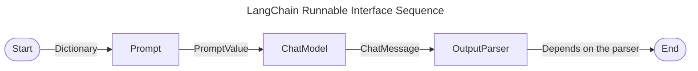

## Requirements

- [OpenAI][platform-openai]: ChatGPT 관리
- [LangChain][langchain]: Large Language Model (LLM) 기반 application 개발을 위한 framework
- [Streamlit][streamlit]: Python 코드로 빠르게 web 기반 UI 제작해주는 모듈
- [Pinecone][pinecone]: Vector를 위한 Database
- [Huggingface][huggingface]: 다양한 model 적용
- [FastAPI][fastapi]: API 구축 framework

### Usage Limits for OpenAI

[OpenAI][platform-openai]에서 `Settings` > `Limits` > `Usage limits`에서 설정 가능하다.

## virtualenv

[virtualenv][post-virtualenv]를 설정한다.

## Jupyter Notebook

`.ipynb` 확장자를 가진 파일을 생성한다.

## dotenv

`.env` 파일을 생성하고 `OPENAI_API_KEY`에 자신의 API KEY를 입력해야 한다.

`OpenAI` module은 해당 환경변수를 찾아서 사용한다.

```text
OPENAI_API_KEY="sk-xxxx"
```

## Call Basic LLM

[link][openai-models]에서 `OpenAI`에서 지원하는 model 목록 확인할 수 있다.

- Large Language Model (LLM): 언어를 이해하고 생성하는 데 사용되는 대규모 인공지능 모델. default로 `text-davinci-003`를 사용한다.
  - [Pricing][openai-pricing]를 참고하여 token 당 저렴한 모델을 설정하여 사용하면 된다.

> [Deprecations][openai-deprecations]에 의하면 `text-davinci-003` model은 2024-01-04부로 지원이 중단되었다.
> {: .prompt-danger }

```python
from langchain.llms.openai import OpenAI

llm = OpenAI(model="gpt-3.5-turbo-instruct")
llm.predict("How many planets are there?")
```

- Chat Model: 자연어 대화에 최적화된 모델. default로 `gpt-3.5-turbo`를 사용한다.

```python
from langchain.chat_models import ChatOpenAI

chat = ChatOpenAI(
  temperature=0.1
)
chat.predict("How many planets are there?")
```

## Predict using Message Schema

```python
from langchain.chat_models import ChatOpenAI
from langchain.schema import HumanMessage, AIMessage, SystemMessage

chat = ChatOpenAI(temperature=0.1)

messages = [
    SystemMessage(content="You are a geography expert. And you are only reply in Italian."),
    AIMessage(content="Ciao mi chiamo Paolo!"),
    HumanMessage(content="What is the distance between Maxico and Thailand. Also What is your name?")
]

chat.predict_messages(messages)
```

temperature
: 0 - 1 사이 소수점을 입력하여 창의성을 설정한다. 높을수록 창의성과 무작위성 이 높다.

HumanMessage
: 사람이 질문하는 자연어 message

AIMessage
: AI가 대답하는 message

SystemMessage
: LLM에 설정을 전달하는 message. 미리 학습

## Prompt Template

PromptTemplate
: string 기반 template을 prompt하기 위해 사용

```python
from langchain.chat_models import ChatOpenAI
from langchain.prompts import PromptTemplate

template = PromptTemplate.from_template(
    "What is the distance between {country_a} and {country_b}"
)
# template = PromptTemplate(
#     template="What is the distance between {country_a} and {country_b}",
#     input_variables=["country_a", "country_b"]
# )

prompt = template.format(country_a="Maxico", country_b="Thailand")

chat = ChatOpenAI(temperature=0.1)

chat.predict(prompt)
```

ChatPromptTemplate
: message로부터 template을 생성하여 prompte하기 위해 사용

```python
from langchain.chat_models import ChatOpenAI
from langchain.prompts import ChatPromptTemplate

template = ChatPromptTemplate.from_messages([
    ("system", "You are a geography exprt. And you only reply in {language}."),
    ("ai", "Ciao mu chiamo {name}!"),
    ("human", "What is the distance between {country_a} and {country_b}. Also, what is your name?")
])

prompt = template.format_messages(
    language="Greek",
    name="Socrates",
    country_a="Maxico",
    country_b="Thailand"
)

chat.predict_messages(prompt)
```

## Output Parser and LangChain Expression Language (LCEL)

### Output Parser

AIMessage를 `python` `list` 형태로 획득할 수 있는 예제이다.

```python
from langchain.chat_models import ChatOpenAI
from langchain.prompts import ChatPromptTemplate
from langchain.schema import BaseOutputParser

chat = ChatOpenAI(temperature=0.1)

class CommaOutputParser(BaseOutputParser):
    def parse(self, text):
        items = text.strip().split(",")
        return list(map(str.strip, items))

template = ChatPromptTemplate.from_messages([
    ("system", "You are a list generating machine. Everything you are asked will be answered with a comma separated list of max {max_items} in lowercase. Do NOT reply with anything else."),
    ("human", "{question}")
])

prompt = template.format_messages(
    max_items=10,
    question="What are the planets?"
)

result = chat.predict_messages(prompt)

p = CommaOutputParser()

p.parse(result.content)
# ['mercury', 'venus', 'earth', 'mars', 'jupiter', 'saturn', 'uranus', 'neptune']
```

### LangChain Expression Language (LCEL)

`LCEL`을 이용해서 `Output Parser` 예제 코드를 재활용 하여 아래와 같이 단순화할 수 있다.

```python
chain = template | chat | CommaOutputParser()

chain.invoke({
    "max_items": 5,
    "question": "What are the pokemons?"
})
# ['pikachu', 'charmander', 'bulbasaur', 'squirtle', 'jigglypuff']
```

위 예제에서 `chain`은 [LangChain Interface][langchain-interface]의 component 중 다음을 이용한 것이다.

- [x] Prompt (template)
- [x] ChatModel (chat)
- [ ] LLM
- [x] OutputParser (CommaOutputParser)
- [ ] Retriever
- [ ] Tool

`invoke` 함수 실행 시 각 component가 순차적으로 실행된다.



1. `Prompt` component는 invoke 함수의 매개변수로 입력한 Dictionary를 input 받아 `template` 변수를 통해 처리 후 output된 PromptValue를 `ChatModel` component에 전달한다.
2. `ChatModel` component는 PromptValue를 input 받아 `chat` 변수를 통해 처리 후 output된 ChatMessage를 `OutputParser` component에 전달한다.
3. `OutputParser` component는 ChatModel output을 input 받아 `CommaOutputParser` 변수를 통해 처리 후 output한다. (output type은 `Depends on the parser`이다.)

## Chaining Chains

```python
from langchain.chat_models import ChatOpenAI
from langchain.prompts import ChatPromptTemplate
from langchain.callbacks import StreamingStdOutCallbackHandler

chat = ChatOpenAI(
    temperature=0.1,
    streaming=True, # Check the chatmodel response creation process
    callbacks=[StreamingStdOutCallbackHandler()] # Callback for streaming
)

chef_prompt = ChatPromptTemplate.from_messages([
    ("system", "You are a world-class international chef. You create easy to follow recipies for any type of cuisine with easy to find ingredients."),
    ("human", "I want to cook {cuisine} food.")
])

chef_chain = chef_prompt | chat

veg_chef_prompt = ChatPromptTemplate.from_messages([
    ("system", "You are a vegetarian chef specialized on making traditional recipies vegetarian. You find alternative ingredients and explain their preparation. You don't radically modify the recipe. If there is no alternative for a food just say you don't know how to replace it."),
    ("human", "{recipe}")
])

veg_chain = veg_chef_prompt | chat

final_chain = {"recipe": chef_chain} | veg_chain # Runnable map

final_chain.invoke({
    "cuisine": "indian"
})
```

위 예제를 통해 chain간 연결할 수 있다.

chef_chain의 output이 "recipe" key를 가진 dictionay의 value로 할당되고 veg_chain의 input으로 전달된다.

## LangChain Modules

[LangChain Module][langchain-modules]에서 module을 확인할 수 있다.

### FewShotPromptTemplate

대답할 예제를 제공하는 template으로서, `PromptTemplate`에 기반한 `example_template`을 입력해야 한다.

`example_template`는 예제를 형식화하기 위해 사용한다.

```python
from langchain.chat_models import ChatOpenAI
from langchain.prompts import PromptTemplate
from langchain.prompts.few_shot import FewShotPromptTemplate
from langchain.callbacks import StreamingStdOutCallbackHandler

chat = ChatOpenAI(
    temperature=0.1,
    streaming=True, # Check the chatmodel response creation process
    callbacks=[StreamingStdOutCallbackHandler()]
)

examples = [
    {
        "question": "What do you know about France?",
        "answer": """
        Here is what I know:
        Capital: Paris
        Language: French
        Food: Wine and Cheese
        Currency: Euro
        """,
    },
    {
        "question": "What do you know about Italy?",
        "answer": """
        I know this:
        Capital: Rome
        Language: Italian
        Food: Pizza and Pasta
        Currency: Euro
        """,
    },
    {
        "question": "What do you know about Greece?",
        "answer": """
        I know this:
        Capital: Athens
        Language: Greek
        Food: Souvlaki and Feta Cheese
        Currency: Euro
        """,
    },
]

example_template = """
    Human: {question}
    AI: {answer}
"""

example_prompt = PromptTemplate.from_template(example_template)

prompt = FewShotPromptTemplate(
    example_prompt=example_prompt,
    examples=examples,
    suffix="Human: What do you know about {country}?",
    input_variables=["country"]
)

chain = prompt | chat

chain.invoke({
    "country": "Germany"
})
# AI:
#         Here is what I know:
#         Capital: Berlin
#         Language: German
#         Food: Bratwurst and Sauerkraut
#         Currency: Euro
```

### FewShotChatMessagePromptTemplate

`FewShotPromptTemplate`과 달리 `ChatPromptTemplate`에 기반한 `example_template`을 입력해야 한다.

아래 예제에서 `ChatPromptTemplate`을 두 번 사용했다.

```python
from langchain.chat_models import ChatOpenAI
from langchain.prompts import ChatPromptTemplate
from langchain.prompts.few_shot import FewShotChatMessagePromptTemplate
from langchain.callbacks import StreamingStdOutCallbackHandler

chat = ChatOpenAI(
    temperature=0.1,
    streaming=True, # Check the chatmodel response creation process
    callbacks=[StreamingStdOutCallbackHandler()]
)

examples = [
    {
        "country": "France",
        "answer": """
        Here is what I know:
        Capital: Paris
        Language: French
        Food: Wine and Cheese
        Currency: Euro
        """,
    },
    {
        "country": "Italy",
        "answer": """
        I know this:
        Capital: Rome
        Language: Italian
        Food: Pizza and Pasta
        Currency: Euro
        """,
    },
    {
        "country": "Greece",
        "answer": """
        I know this:
        Capital: Athens
        Language: Greek
        Food: Souvlaki and Feta Cheese
        Currency: Euro
        """,
    },
]

example_prompt = ChatPromptTemplate.from_messages(
    [
        ("human", "What do you know about {country}?"),
        ("ai", "{answer}"),
    ]
)

example_prompt = FewShotChatMessagePromptTemplate(
    example_prompt=example_prompt,
    examples=examples,
)

final_prompt = ChatPromptTemplate.from_messages(
    [
        ("system", "You are a geography expert, you give short answers."),
        example_prompt,
        ("human", "What do you know about {country}?"),
    ]
)

chain = final_prompt | chat

chain.invoke({
    "country": "Germany"
})
# I know this:
# Capital: Berlin
# Language: German
# Food: Bratwurst and Sauerkraut
# Currency: Euro
```

[nomadcoders-fullstack-gpt]: https://nomadcoders.co/fullstack-gpt
[platform-openai]: https://platform.openai.com
[langchain]: https://www.langchain.com
[streamlit]: https://streamlit.io
[pinecone]: https://www.pinecone.io
[huggingface]: https://huggingface.co
[fastapi]: https://fastapi.tiangolo.com
[post-virtualenv]: https://applic8ion.github.io/posts/python-virtualenv/
[openai-models]: https://platform.openai.com/docs/models
[openai-deprecations]: https://platform.openai.com/docs/deprecations
[openai-pricing]: https://openai.com/pricing
[langchain-interface]: https://python.langchain.com/docs/expression_language/interface/
[langchain-modules]: https://python.langchain.com/docs/modules/
