## Itineraries

```mermaid
gantt
dateFormat HH:mm
axisFormat %H:%M
title Joshua Tree Trip
section Day 1
to Entering Joshua Tree: active, d1-1, 08:30, 11:30
Cottonwood: active, d1-2, after d1-1, 12:20
Cholla Cactus Garden: active, d1-3, after d1-2, 13:30
Arch Rock: active, d1-4, after d1-3, 14:30
Skull Rock: active, d1-5, after d1-4, 15:30
North Visitor Center: active, d1-6, after d1-5, 16:00
section Day 2
to Palm Springs : d2-1, 09:00, 30m
to Home: d2-2, after d2-1, 18:30
```

## to Entering Joshua Tree

{: .shadow .rounded-10 h="500" }
_Entering Joshua Tree_

{: .shadow .rounded-10 h="500" }
_Visitor Center_

`Josua Tree`는 California 남동쪽에 위치해 있으며, 대체적으로 걷기 쉬운 trail이 많이 있다.

`Josua Tree`는 북쪽에 두 곳, 남쪽에 한 곳, 3개의 출입구가 있다.

우리는 남쪽에 위치한 Cottonwood를 통해 입장했다.

Visitor Center에서 입장권을 확인하고 pass를 room mirror에 걸어야 한다. (미이행 시 벌금을 낼 수 있다.)

Visitor Center 내부는 매우 협소하고, 기념품 또한 판매하고 있다.

{: .shadow .rounded-10 w="500" }
_Pass_

## Cottonwood Trail

{: .shadow .rounded-10 h="500" }
_Cottonwood 1_

{: .shadow .rounded-10 h="500" }
_Cottonwood 2_

Visitor Center 인근에 위치해 있으며, 털을 뒤집어쓴 야자수를 볼 수 있다.

## Cholla Cactus Garden

{: .shadow .rounded-10 h="500" }
_Cholla Cactus Garden 1_

{: .shadow .rounded-10 h="500" }
_Cholla Cactus Garden 2_

수많은 선인장 정원이 넓게 깔려 있다.

가시에 독성이 있을 수 있으니, 만지지 않도록 주의한다.

가는 길에 `Ocotilo`를 쉽게 발견할 수 있다.

{: .shadow .rounded-10 w="500" }
_Cholla Cactus Garden 2_

## Arch Rock

{: .shadow .rounded-10 h="500" }
_Arch Rock 1_

{: .shadow .rounded-10 h="500" }
_Arch Rock 2_

{: .shadow .rounded-10 h="500" }
_Arch Rock 3_

arch 형태의 바위가 있다.

관광객들이 사진을 많이 찍는 장소 중 하나이다.

## Skull Rock

{: .shadow .rounded-10 w="500" }
_Skull Rock_

{: .shadow .rounded-10 h="500" }
_Skull Rock Trail_

`Josua Tree`의 Trade mark라고 불리는 장소이다.

이름 그대로 해골 모양 바위를 볼 수 있다.

## North Visitor Center

{: .shadow .rounded-10 h="500" }
_North Visitor Center 1_

{: .shadow .rounded-10 h="500" }
_North Visitor Center 2_

숙소를 가기 전 들른 장소이다.

Cottonwood Visitor Center 보다 크고 깔끔하다.

기념품을 팔지만 종류가 많지 않다.

To be continue...
