## Itineraries

```mermaid
gantt
dateFormat HH:mm
axisFormat %H:%M
title Joshua Tree Trip
section Day 1
to Entering Joshua Tree: active, d1-1, 08:30, 3h
Cottonwood: active, d1-2, after d1-1, 12:20
Cholla Cactus Garden: active, d1-3, after d1-2, 13:30
Arch Rock: active, d1-4, after d1-3, 14:30
Skull Rock: active, d1-5, after d1-4, 15:30
North Visitor Center: active, d1-6, after d1-5, 16:00
Accommodation: active, d1-7, after d1-6, 8h
section Day 2
to Raising Cane's : d2-1, 10:40, 100m
Palm Springs Cable Car : d2-2, after d2-1, 16:00
to Home: d2-3, after d2-2, 2h
```

## to Entering Joshua Tree

{: .shadow .rounded-10 h="500" }
_Entering Joshua Tree_

{: .shadow .rounded-10 h="500" }
_Visitor Center_

`Josua Tree`는 California 남동쪽에 위치해 있으며, 대체적으로 걷기 쉬운 trail이 많이 있다.

`Josua Tree`는 북쪽에 두 곳, 남쪽에 한 곳, 3개의 출입구가 있다.

우리는 남쪽에 위치한 Cottonwood를 통해 입장했다.

Visitor Center에서 입장권을 확인하고 pass를 room mirror에 걸어야 한다. (미이행 시 벌금을 낼 수 있다.)

Visitor Center 내부는 매우 협소하고, 기념품도 판매하고 있다.

{: .shadow .rounded-10 w="500" }
_Pass_

## Cottonwood Trail

{: .shadow .rounded-10 h="500" }
_Cottonwood 1_

{: .shadow .rounded-10 h="500" }
_Cottonwood 2_

Visitor Center 인근에 위치해 있으며, 털을 뒤집어쓴 야자수를 볼 수 있다.

## Cholla Cactus Garden

{: .shadow .rounded-10 h="500" }
_Cholla Cactus Garden 1_

{: .shadow .rounded-10 h="500" }
_Cholla Cactus Garden 2_

수많은 선인장 정원이 넓게 깔려 있다.

가시에 독성이 있을 수 있으니, 만지지 않도록 주의한다.

가는 길에 `Ocotilo`를 쉽게 발견할 수 있다.

{: .shadow .rounded-10 w="500" }
_Cholla Cactus Garden 2_

## Arch Rock

{: .shadow .rounded-10 h="500" }
_Arch Rock 1_

{: .shadow .rounded-10 h="500" }
_Arch Rock 2_

{: .shadow .rounded-10 h="500" }
_Arch Rock 3_

arch 형태의 바위가 있다.

관광객들이 사진을 많이 찍는 장소 중 하나이다.

## Skull Rock

{: .shadow .rounded-10 w="500" }
_Skull Rock_

{: .shadow .rounded-10 h="500" }
_Skull Rock Trail_

`Josua Tree`의 Trade mark라고 불리는 장소이다.

이름 그대로 해골 모양 바위를 볼 수 있다.

## North Visitor Center

{: .shadow .rounded-10 h="500" }
_North Visitor Center 1_

{: .shadow .rounded-10 w="500" }
_North Visitor Center 2_

`Cap Rock Nature Trail`, `Keys View`, `Hidden Valley Nature Trail`도 방문할 계획이었지만, 일행들의 체력을 고려하여 계획을 변경했다.

숙소를 가기 전 `Josua Tree` 북동쪽에 위치한 `North Visitor Center`에 방문했다.

`Cottonwood Visitor Center` 보다 크고 깔끔했다.

기념품 종류가 많지 않았지만 `Josha Tree`의 다양한 명소가 적혀있는 자석을 구매했다.

## Accommodation

{: .shadow .rounded-10 w="500" }
_Accommodation 1_

{: .shadow .rounded-10 w="500" }
_Accommodation 2_

{: .shadow .rounded-10 w="500" }
_Accommodation 3_

`Twentynine Palms`에 위치한 [Airbnb][airbnb] 숙소이다.

비용은 꽤 비싼 편이지만, 감성 가득한 방과 화장실이 각각 2개이고, 울타리가 쳐져있는 뒷마당에서 firewood용 난로와 hammock 등이 있었다.

무전기, 망원경, 휴대 조명, board game, 장작을 태우기 위한 고체연로, barbeque grill 등 유용한 도구들도 많았다.

단, barbeque grill은 gas로 동작하는 방식인데, host에게 이용 가능 여부를 물으니, 잔여 gas를 확신(?)할 수 없다는 답변을 받았다.

$15을 내면, 확실히 사용할 수 있도록 확인해주겠다고 하여, 추가로 지불했다.

저녁식사 후, 숙소 도착 전 미리 구입했던 firewood를 고체 연료와 함께 태우면서, marshmallow를 구워먹었다.

사진보다 실제로 수많은 별들을 볼 수 있어서 좋았다.

[airbnb]: https://ko.airbnb.com/rooms/847187743150977560?viralityEntryPoint=1&unique_share_id=8CC32733-89D5-42E4-BDF3-194F69155CEB&slcid=50eb9c72bb3745679f1981df57996a08&s=76&feature=share&adults=1&channel=native&slug=OJ7oI4mI&_set_bev_on_new_domain=1714891324_NDNiYmU0NGI4MDZi&source_impression_id=p3_1714891325_IdudeLLlnX5%2BxLu8
