## Itineraries

```mermaid
gantt
dateFormat HH:mm
axisFormat %H:%M
title Joshua Tree Trip
section Day 1
to Entering Joshua Tree: d1-1, 08:30, 3h
Cottonwood: d1-2, after d1-1, 12:20
Cholla Cactus Garden: d1-3, after d1-2, 13:30
Arch Rock: d1-4, after d1-3, 14:30
Skull Rock: d1-5, after d1-4, 15:30
North Visitor Center: d1-6, after d1-5, 16:00
Accommodation: d1-7, after d1-6, 8h
section Day 2
to Raising Cane's : active, d2-1, 10:40, 100m
Palm Springs Cable Car : active, d2-2, after d2-1, 16:00
to Home: active, d2-3, after d2-2, 2h
```

## to Raising Cane's

{: .shadow .rounded-10 h="500" }
_Rasing Cane's_

## Palm Springs Cable Car

{: .shadow .rounded-10 w="500" }
_Rasing Cane's_

{: .shadow .rounded-10 w="500" }
_Palm Springs at the top_

{: .shadow .rounded-10 h="500" }
_Top_

{: .shadow .rounded-10 h="500" }
_Descending View_

## to Home
