## Itineraries

```mermaid
gantt
dateFormat HH:mm
axisFormat %H:%M
title Joshua Tree Trip
section Day 1
to Entering Joshua Tree: d1-1, 08:30, 3h
Cottonwood: d1-2, after d1-1, 12:20
Cholla Cactus Garden: d1-3, after d1-2, 13:30
Arch Rock: d1-4, after d1-3, 14:30
Skull Rock: d1-5, after d1-4, 15:30
North Visitor Center: d1-6, after d1-5, 16:00
Accommodation: d1-7, after d1-6, 8h
section Day 2
to Raising Cane's : active, d2-1, 10:40, 100m
Palm Springs Cable Car : active, d2-2, after d2-1, 16:00
to Home: active, d2-3, after d2-2, 2h
```

## to Raising Cane's

{: .shadow .rounded-10 h="500" }
_Rasing Cane's_

`Palm Springs Cable Car` 탑승 전 식사를 위해 방문했다.

첫 방문은 아니었지만 월 2회 이상 방문할 정도로 좋아하는 편이다.

`Rasing Cane's`는 메뉴가 아주 단순하다.

`Box Combo`, `3 Finger Combo`, `Caniac Combo`는 `chicken finger`, `coleslaw`의 개수의 차이만 있을 뿐이다.

`Sandwich Combo`는 burger 빵에 `chicken finger`와 달리 넙적한 모양의 치킨과, 양상추만 들어있다.

`Chick-Fill-A`와 달리 모든 메뉴에 소스는 한 종류만 제공된다.

## Palm Springs Cable Car

{: .shadow .rounded-10 w="500" }
_Rotating Tramway_

{: .shadow .rounded-10 w="500" }
_Palm Springs at the top_

{: .shadow .rounded-10 h="500" }
_Top_

{: .shadow .rounded-10 h="500" }
_Descending View_

[Palm Springs Cable Car][palm-springs-tramway-wiki]는 1963년 9월 개장한 역사가 오래된 cable car로서 `San Jacinto Peak` 정상으로 이동한다.

어른 왕복 ticket은 $30.95이고, 정상에 위치한 `Pines Café` 레스토랑 이용 금액을 포함한 ticket은 $41이다 [link][palm-springs-tramway-ticket].

ticket에 기재된 탑승 시간 전 15분 전부터 줄에서 대기할 수 있고, 검표원으로부터 표를 검사받고 탑승장으로 이동할 수 있었다.

2000년에 바닥이 회전하면서 올라가는 tramway로 교체되었기 때문에, `Chino Canyon`과 사막 바닥 곳곳을 둘러볼 수 있다.

탑승 당일 날씨가 따뜻한 편이었지만, 도착한 정상에서는 눈이 오고 매우 쌀쌀했다.

`Pines Café`에서 먹었던 hot choco는 매우 달았다.

## to Home

`Palm Springs Cable Car`에서 집으로 돌아가는 길에 `Desert Hill Premium Outlet`을 방문했지만, 사진이 없어서 자세히 다루지 않았다.

`Joshua Tree`만을 다녀올 계획이라면 당일치기도 가능하다고 생각된다.

개인적으로 별을 관측하기 좋은 날짜를 선택하여, 편하게 숙박하는 편이 좋을 것 같다.

[palm-springs-tramway-wiki]: https://en.wikipedia.org/wiki/Palm_Springs_Aerial_Tramway
[palm-springs-tramway-ticket]: https://pstramway.com/tickets/
