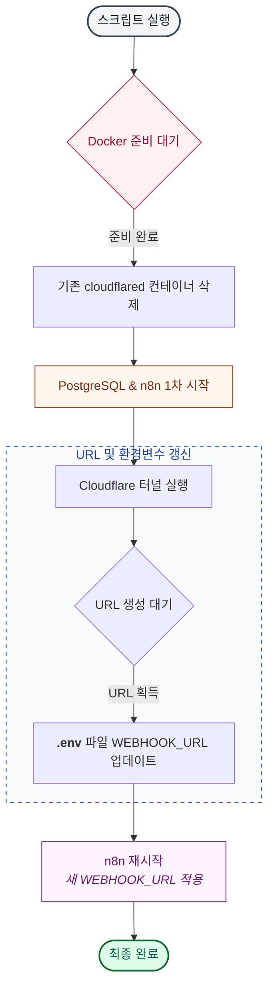

본 포스팅은 Synology NAS의 `DSM`에 `Docker`를 통해 `n8n`을 설치하고 실행하는 방법을 소개한다.

`n8n` 기본 사용법은 지난 [n8n Setup in a Local Environment](/posts/n8n-setup-in-a-local-environment/) 포스팅을 참고한다.

위 포스팅은 `macOS`에서 정상 실행되었지만, `DSM`에서는 `volume` 설정과 권한 문제로 정상 실행되지 않았다.

## Process

DSM이 켜지면 아래 절차가 순차적으로 수행되어야 한다.

1. `cloudflare`가 가장 먼저 실행되어 외부에서 `n8n`에 접속할 수 있도록 신규 URL을 생성해야 한다.
2. 해당 URL을 `.env` 파일의 `WEBHOOK_URL` 환경변수에 설정하고, `n8n`을 실행한다.
3. `n8n`이 실행되면 `postgresql`에 접속하여 `n8n`을 실행한다.

이를 도식화하면 다음과 같다.



## Docker Compose Setup

아래는 `docker-compose.yml` 파일 예시이다.

DSM에서 해당 프로젝트를 저장한 경로는 `/volume1/docker/n8n` 이다.

권한 문제와 연관되므로 `volumes` 옵션을 주의한다.

환경변수는 `.env` 파일에 설정한다.

```yaml
services:
  postgresql:
    image: postgres:17
    restart: unless-stopped
    environment:
      - POSTGRES_DB=${POSTGRES_DB}
      - POSTGRES_USER=${POSTGRES_USER}
      - POSTGRES_PASSWORD=${POSTGRES_PASSWORD}
    volumes:
      - /volume1/docker/n8n/pg_data:/var/lib/postgresql/data
    healthcheck:
      test: ["CMD-SHELL", "pg_isready -U ${POSTGRES_USER} -d ${POSTGRES_DB}"]
      interval: 10s
      timeout: 5s
      retries: 5
      start_period: 30s
    logging:
      driver: json-file
      options:
        max-size: "10m"
        max-file: "3"
    networks:
      - n8n-net

  cloudflared:
    image: cloudflare/cloudflared:latest
    restart: unless-stopped
    command: tunnel --url http://n8n:5678 --no-autoupdate
    logging:
      driver: json-file
      options:
        max-size: "10m"
        max-file: "3"
    networks:
      - n8n-net

  n8n:
    image: n8nio/n8n:latest
    user: "1026:100"
    restart: unless-stopped
    ports:
      - "5678:5678"
    environment:
      - DB_TYPE=postgresdb
      - DB_POSTGRESDB_HOST=postgresql
      - DB_POSTGRESDB_PORT=5432
      - DB_POSTGRESDB_DATABASE=${POSTGRES_DB}
      - DB_POSTGRESDB_USER=${POSTGRES_USER}
      - DB_POSTGRESDB_PASSWORD=${POSTGRES_PASSWORD}
      - N8N_USER_FOLDER=/n8n_data
      - N8N_EDITOR_BASE_URL=${N8N_EDITOR_BASE_URL}
      - WEBHOOK_URL=${WEBHOOK_URL}
      - GENERIC_TIMEZONE=Asia/Seoul
      - N8N_SECURE_COOKIE=${N8N_SECURE_COOKIE}
      - N8N_BLOCK_ENV_ACCESS_IN_NODE=false
    volumes:
      - /volume1/docker/n8n/n8n_data:/n8n_data
    depends_on:
      postgresql:
        condition: service_healthy
      cloudflared:
        condition: service_started
    logging:
      driver: json-file
      options:
        max-size: "10m"
        max-file: "3"
    networks:
      - n8n-net

networks:
  n8n-net:
    driver: bridge
```

## Script

[Process](/posts/hosting-n8n-from-dsm/#process)를 수행하기 위한 스크립트인 `restart.sh`를 다음과 같이 작성하고, `/docker/n8n/scripts` 디렉토리에 저장한다.

```bash
#!/bin/bash

# ContainerManager 패키지 symlink를 사용하므로 PATH에 /usr/local/bin 명시
export PATH="/usr/local/bin:/usr/bin:/bin:$PATH"

# DSM Task Scheduler에서 root로 실행 시 /root/.docker/config.json 권한 오류로
# docker compose 플러그인이 로드되지 않는 문제 해결
export DOCKER_CONFIG=/tmp/docker-config-n8n
mkdir -p "$DOCKER_CONFIG"

# 프로젝트 루트 및 스크립트 경로 설정
SCRIPT_DIR="$(cd "$(dirname "$0")" && pwd)"
PROJECT_ROOT="$(dirname "$SCRIPT_DIR")"
ENV_FILE="$PROJECT_ROOT/.env"

cd "$PROJECT_ROOT"

# 부팅 직후 ContainerManager(Docker)가 아직 준비되지 않을 수 있으므로 대기
echo "Docker 데몬 준비 대기 중..."
MAX_DOCKER_WAIT=120
DOCKER_WAIT=0
until docker compose version >/dev/null 2>&1; do
    if [ $DOCKER_WAIT -ge $MAX_DOCKER_WAIT ]; then
        echo "❌ Docker 데몬이 ${MAX_DOCKER_WAIT}초 내에 준비되지 않았습니다. 종료합니다."
        exit 1
    fi
    sleep 3
    DOCKER_WAIT=$((DOCKER_WAIT + 3))
    echo "  대기 중... (${DOCKER_WAIT}s / ${MAX_DOCKER_WAIT}s)"
done
echo "✅ Docker 준비 완료"

echo "🚀 Cloudflare Tunnel 업데이트 시작..."

# 1. cloudflared 컨테이너 재생성 (새 URL 발급을 위해)
docker compose stop cloudflared 2>/dev/null
docker compose rm -f cloudflared 2>/dev/null

# 2. 전체 서비스 시작 (cloudflared 제외)
echo "Starting services..."
docker compose up -d postgresql n8n

# 3. cloudflared 컨테이너 시작
echo "Cloudflare Tunnel 실행 중..."
docker compose up -d cloudflared

# 4. Docker 로그에서 URL 추출 대기
echo -n "URL 생성 대기 중"
URL=""
MAX_RETRIES=30
RETRY_COUNT=0

while [ $RETRY_COUNT -lt $MAX_RETRIES ]; do
    URL=$(docker compose logs cloudflared 2>&1 | grep -oE "https://[a-zA-Z0-9-]+\.trycloudflare\.com" | head -n 1)
    if [ -n "$URL" ]; then
        break
    fi
    sleep 1
    RETRY_COUNT=$((RETRY_COUNT+1))
    echo -n "."
done
echo ""

if [ -z "$URL" ]; then
    echo "❌ 터널 URL 획득 실패. 로그를 확인하세요:"
    docker compose logs cloudflared
    exit 1
fi

echo "✅ 새 URL 발견: $URL"

# 5. .env 파일 업데이트 (Linux sed 문법)
if [ -f "$ENV_FILE" ]; then
    if grep -q "WEBHOOK_URL=" "$ENV_FILE"; then
        sed -i "s|^WEBHOOK_URL=.*|WEBHOOK_URL=$URL|" "$ENV_FILE"
    else
        echo "WEBHOOK_URL=$URL" >> "$ENV_FILE"
    fi
    echo "📝 .env 파일 업데이트 완료"
else
    echo "⚠️ .env 파일을 찾을 수 없어 업데이트를 스킵합니다."
fi

# 6. n8n 재시작으로 새 WEBHOOK_URL 적용
echo "n8n 재시작 중 (새 WEBHOOK_URL 적용)..."
docker compose up -d n8n

echo "✨ 모든 작업이 완료되었습니다!"
echo "Cloudflare Tunnel URL: $URL"
echo "주의: 시스템 재부팅 시 restart.sh를 다시 실행해야 합니다."
```

## DSM Task Scheduler Setup

DSM이 reboot될 때마다 `restart.sh`가 자동 실행되도록 설정해야 한다.

1. DSM > 제어판 > 작업 스케줄러 > 생성 > 트리거된 작업
2. **일반** 탭:
   - 작업 이름: `n8n restart`
   - 사용자: `root`
   - 이벤트: `부팅`
3. **작업 설정** 탭 > 실행 명령:
   ```bash
   bash /volume1/docker/n8n/scripts/restart.sh
   ```

## Test

1. `.env` 파일의 `WEBHOOK_URL`을 사용하여 브라우저를 통해 n8n을 실행하여 확인한다.
2. n8n에서 Workflow를 하나 생성하고, Webhook 노드가 `WEBHOOK_URL`을 사용했을 때 정상 동작하는지 테스트한다.
